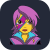
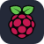

# 🖼️ Icon URL Generator Project

## 📋 Overview

The Icon URL Generator is a web application built using Next.js `^14.2.3`. It allows users to select multiple icons, configure display settings, and generate a URL to access the selected icons in SVG format. The app leverages dynamic icon data for versatile usage.

## ✨ Features

- **Icon Selection**: Users can search and select multiple icons from a predefined list or select all available icons.
- **Theme Selection**: Users can choose between dark and light themes for the icons.
- **Configuration Options**: Users can configure the number of icons per line and the space between icons.

## 📄 Documentation

- [Specifying Icons](#specifying-icons)
- [Themed Icons](#themed-icons)
- [Icons Per Line](#icons-per-line)
- [Centering Icons](#centering-icons)

## 💡 Specifying Icons

To add the skills icon element to your README, copy and paste the code block below. Change the `?i=js,html,css` to a list of your skills separated by commas. You can find a full list of icons [here](#icons-list).

```md
[](https://icons-alpha.vercel.app)
```

[](https://icons-alpha.vercel.app)

## 🎨 Themed Icons

You can specify a theme for the icons by adding the `&theme=light` parameter to the URL. The default theme is dark.

**Light Theme Example:**

```md
[](https://icons-alpha.vercel.app)
```

[](https://icons-alpha.vercel.app)


**Dark Theme Example:**

```md
[](https://icons-alpha.vercel.app)
```

[](https://icons-alpha.vercel.app)


## 📏 Icons Per Line

You can specify how many icons you would like per line using the `&perLine=3` parameter. The default is 10.

```md
[](https://icons-alpha.vercel.app)
```

[](https://icons-alpha.vercel.app)

## 🔲 Centering Icons

To center the icons in your README, use the following HTML:

```html
<p align="center">
  <a href="https://icons-alpha.vercel.app">
    
  </a>
</p>
```

<p align="center">
  <a href="https://icons-alpha.vercel.app">
    
  </a>
</p>

## 🛠️ Installation

1. Clone the repository:
   ```bash
   git clone https://github.com/xMahdiRz/Icons.git
   cd Icons
   ```

2. Install the dependencies:
   ```bash
   npm install
   ```

3. Start the development server:
   ```bash
   npm run dev
   ```

4. Open your browser and navigate to `http://localhost:PORT`.

## 📁 Project Structure

- **components/ui**: Contains reusable UI components like `Card`, `Button`, `Input`, and `Select` from [`shadcn/ui`](https://ui.shadcn.com/).
- **components**: Contains application-specific components such as `ThemeChanger`.
- **pages/api**: Contains API route handlers, including the handler to generate the SVG icons.
- **icons.json**: JSON file containing the list of available icons.

## 🌟 Example

An example URL generated by the application might look like this:

```md
[](https://icons-alpha.vercel.app/)
```

### Result:
[](https://icons-alpha.vercel.app/)

This URL retrieves an SVG image with the selected icons displayed according to the specified configurations.

## Development Notes

- **Icon Mapping**: Short names for icons are mapped to their full names to handle shorthand notations.
- **Error Handling**: If an icon or theme does not exist, a placeholder error icon is returned.
- **Dynamic SVG Generation**: The application dynamically generates SVG content based on user selections and configurations.

## Future Improvements

- **Enhanced Search**: Improve the search functionality to include fuzzy search and category-based filtering.
- **Custom Themes**: Allow users to create and save custom themes.

## Contributing

Contributions are welcome! Please follow these steps:

1. Fork the repository.
2. Create a new branch (`git checkout -b feature-branch`).
3. Make your changes.
4. Commit your changes (`git commit -am 'Add new feature'`).
5. Push to the branch (`git push origin feature-branch`).
6. Open a Pull Request.

## License

This project is licensed under the MIT License. See the [LICENSE](LICENSE) file for details.

## Acknowledgements

- Inspired by `https://github.com/tandpfun/skill-icons`
- Special thanks to all contributors and the open-source community.

## Icons List

Here's a list of all the icons currently supported. Feel free to open an issue to suggest icons to add!
Convert Text to Lowercase

|      Icon Id       |                             Icon                             |
| :----------------: | :----------------------------------------------------------: |
|     `ableton`      |        |
|   `activitypub`    |    |
|      `actix`       |          |
|      `adonis`      |              |
|        `ae`        |        |
|     `aiscript`     |       |
|     `alpinejs`     |       |
|     `anaconda`     |       |
|  `androidstudio`   |  |
|     `angular`      |        |
|     `ansible`      |             |
|      `apollo`      |              |
|      `apple`       |          |
|     `appwrite`     |            |
|       `arch`       |           |
|     `arduino`      |             |
|      `astro`       |               |
|       `atom`       |                |
|        `au`        |            |
|     `autocad`      |        |
|       `aws`        |            |
|       `azul`       |                |
|      `azure`       |          |
|      `babel`       |               |
|       `bash`       |           |
|       `bevy`       |           |
|    `bitbucket`     |      |
|     `blender`      |        |
|    `bootstrap`     |           |
|       `bsd`        |            |
|       `bun`        |            |
|        `c`         |                   |
|        `cs`        |                  |
|       `cpp`        |                 |
|     `crystal`      |        |
|    `cassandra`     |      |
|      `clion`       |          |
|     `clojure`      |        |
|    `cloudflare`    |     |
|      `cmake`       |          |
|     `codepen`      |        |
|   `coffeescript`   |   |
|       `css`        |                 |
|     `cypress`      |        |
|        `d3`        |             |
|       `dart`       |           |
|      `debian`      |         |
|       `deno`       |           |
|      `devto`       |          |
|     `discord`      |             |
|       `bots`       |         |
|    `discordjs`     |      |
|      `django`      |              |
|      `docker`      |              |
|      `dotnet`      |              |
|     `dynamodb`     |       |
|     `eclipse`      |        |
|  `elasticsearch`   |  |
|     `electron`     |            |
|      `elixir`      |         |
|      `elysia`      |         |
|      `emacs`       |               |
|      `ember`       |               |
|     `emotion`      |        |
|     `express`      |      |
|     `fastapi`      |             |
|    `fediverse`     |      |
|      `figma`       |          |
|     `firebase`     |       |
|      `flask`       |          |
|     `flutter`      |        |
|      `forth`       |               |
|     `fortran`      |             |
| `gamemakerstudio`  |     |
|      `gatsby`      |              |
|       `gcp`        |            |
|       `git`        |                 |
|      `github`      |         |
|  `githubactions`   |  |
|      `gitlab`      |         |
|      `gmail`       |          |
|     `gherkin`      |        |
|        `go`        |              |
|      `gradle`      |         |
|      `godot`       |          |
|     `grafana`      |        |
|     `graphql`      |        |
|       `gtk`        |            |
|       `gulp`       |                |
|     `haskell`      |        |
|       `haxe`       |           |
|    `haxeflixel`    |     |
|      `heroku`      |              |
|    `hibernate`     |      |
|       `html`       |                |
|       `htmx`       |           |
|       `idea`       |           |
|        `ai`        |         |
|    `instagram`     |           |
|       `ipfs`       |           |
|       `java`       |           |
|        `js`        |          |
|     `jenkins`      |        |
|       `jest`       |                |
|      `jquery`      |              |
|      `kafka`       |               |
|       `kali`       |           |
|      `kotlin`      |         |
|       `ktor`       |           |
|    `kubernetes`    |          |
|     `laravel`      |        |
|      `latex`       |          |
|       `less`       |           |
|     `linkedin`     |            |
|      `linux`       |          |
|       `lit`        |            |
|       `lua`        |            |
|        `md`        |       |
|     `mastodon`     |       |
|    `materialui`    |     |
|      `matlab`      |         |
|      `maven`       |          |
|       `mint`       |           |
|     `misskey`      |        |
|     `mongodb`      |             |
|      `mysql`       |          |
|      `neovim`      |         |
|      `nestjs`      |         |
|     `netlify`      |        |
|      `nextjs`      |         |
|      `nginx`       |               |
|       `nim`        |            |
|       `nix`        |            |
|      `nodejs`      |         |
|      `notion`      |         |
|       `npm`        |            |
|      `nuxtjs`      |         |
|     `obsidian`     |       |
|      `ocaml`       |               |
|      `octave`      |         |
|      `opencv`      |         |
|    `openshift`     |           |
|    `openstack`     |      |
|       `p5js`       |                |
|       `perl`       |                |
|        `ps`        |           |
|       `php`        |            |
|     `phpstorm`     |       |
|      `pinia`       |          |
|       `pkl`        |            |
|      `plan9`       |          |
|   `planetscale`    |    |
|       `pnpm`       |           |
|     `postgres`     |     |
|     `postman`      |             |
|    `powershell`    |     |
|        `pr`        |            |
|      `prisma`      |              |
|    `processing`    |     |
|    `prometheus`    |          |
|       `pug`        |            |
|     `pycharm`      |        |
|        `py`        |         |
|     `pytorch`      |        |
|        `qt`        |             |
|        `r`         |              |
|     `rabbitmq`     |       |
|      `rails`       |               |
|   `raspberrypi`    |    |
|      `react`       |          |
|    `reactivex`     |      |
|      `redhat`      |         |
|      `redis`       |          |
|      `redux`       |               |
|      `regex`       |          |
|      `remix`       |          |
|      `replit`      |         |
|      `rider`       |          |
|   `robloxstudio`   |        |
|      `rocket`      |              |
|     `rollupjs`     |       |
|       `ros`        |            |
|       `ruby`       |                |
|       `rust`       |                |
|       `sass`       |                |
|      `spring`      |         |
|      `sqlite`      |              |
|  `stackoverflow`   |  |
| `styledcomponents` |    |
|     `sublime`      |        |
|     `supabase`     |       |
|      `scala`       |          |
|     `sklearn`      |    |
|     `selenium`     |            |
|      `sentry`      |              |
|    `sequelize`     |      |
|     `sketchup`     |       |
|     `solidity`     |            |
|     `solidjs`      |        |
|      `svelte`      |              |
|       `svg`        |            |
|      `swift`       |               |
|     `symfony`      |        |
|     `tailwind`     |    |
|      `tauri`       |          |
|    `tensorflow`    |     |
|    `terraform`     |      |
|     `threejs`      |        |
|     `twitter`      |             |
|        `ts`        |          |
|      `ubuntu`      |         |
|      `unity`       |          |
|      `unreal`      |        |
|        `v`         |              |
|       `vala`       |                |
|      `vercel`      |         |
|       `vim`        |            |
|   `visualstudio`   |   |
|       `vite`       |           |
|      `vitest`      |         |
|      `vscode`      |         |
|     `vscodium`     |       |
|       `vue`        |          |
|     `vuetify`      |        |
|       `wasm`       |         |
|     `webflow`      |             |
|     `webpack`      |        |
|     `webstorm`     |       |
|     `windicss`     |       |
|     `windows`      |        |
|    `wordpress`     |           |
|     `workers`      |        |
|        `xd`        |                  |
|       `yarn`       |           |
|       `yew`        |            |
|       `zig`        |            |

---

## Shortnames List 

| Short Name | Full Name        |
|------------|------------------|
| `js`       | `javascript`     |
| `ts`       | `typescript`     |
| `py`       | `python`         |
| `tailwind` | `tailwindcss`    |
| `vue`      | `vuejs`          |
| `nuxt`     | `nuxtjs`         |
| `go`       | `golang`         |
| `cf`       | `cloudflare`     |
| `wasm`     | `webassembly`    |
| `postgres` | `postgresql`     |
| `k8s`      | `kubernetes`     |
| `next`     | `nextjs`         |
| `mongo`    | `mongodb`        |
| `md`       | `markdown`       |
| `ps`       | `photoshop`      |
| `ai`       | `illustrator`    |
| `pr`       | `premiere`       |
| `ae`       | `aftereffects`   |
| `scss`     | `sass`           |
| `sc`       | `scala`          |
| `net`      | `dotnet`         |
| `gatsbyjs` | `gatsby`         |
| `gql`      | `graphql`        |
| `vlang`    | `v`              |
| `amazonwebservices` | `aws`   |
| `bots`     | `discordbots`    |
| `express`  | `expressjs`      |
| `googlecloud` | `gcp`         |
| `mui`      | `materialui`     |
| `windi`    | `windicss`       |
| `unreal`   | `unrealengine`   |
| `nest`     | `nestjs`         |
| `ktorio`   | `ktor`           |
| `pwsh`     | `powershell`     |
| `au`       | `audition`       |
| `rollup`   | `rollupjs`       |
| `rxjs`     | `reactivex`      |
| `rxjava`   | `reactivex`      |
| `ghactions`| `githubactions`  |
| `sklearn`  | `scikitlearn`    |

---

# Thank You!